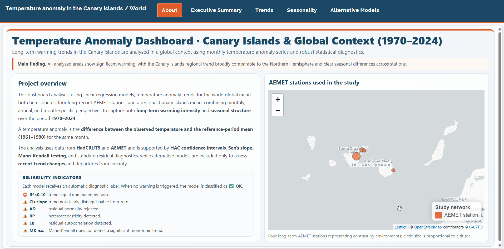

# Temperature Anomaly Analysis in the Canary Islands in a Global Context (1970–2024)

<p align="center">
  <b>Reproducible research project combining statistical rigor, climate data analysis, and applied modeling.</b>
</p>

<p align="center">
  
  
  
</p>

<p align="center">
  <a href="https://mariaalonsoleon.github.io/TemperatureAnomaly/report/temperature_anomaly_analysis.html">
    
  </a>
</p>

<br>

<p align="center">
  
</p>

<p align="center">
  <i>
  Interactive dashboard preview showing dynamic exploration of temperature anomaly trends. An R Markdown implementation of this dashboard is included in this GitHub repository.
  </i>
</p>
<br>

---

## Key findings

> 🌍 **Consistent warming across all regions (1970–2024)**  
> 🇮🇨 Canary Islands exhibit warming rates **comparable to the Northern Hemisphere (~3.4 °C/century)**  
> 📈 Linear trends provide a **robust and stable description**  
> ⚖️ Non-linear models improve fit by **< 2% → linearity holds**  
> 🔍 Weak signals of **recent global warming acceleration** contrasting with regional deceleration in the Canary Islands  
> 🌡️ Results are consistent with **high-emission climate scenarios**

---

## Contents

- 📊 [`report/temperature_anomaly_analysis.html`](https://mariaalonsoleon.github.io/TemperatureAnomaly/report/temperature_anomaly_analysis.html) → full report (interactive HTML, recommended reading)
- 🧠 report/temperature_anomaly_analysis.Rmd → source code of the extended analysis
- 📝 report/conference/OBS_018.docx → conference paper (short version)  
  Accepted for presentation at the XIV AEC Congress (2026)
- 📈 dashboard/temperature_anomaly_dashboard.Rmd → interactive dashboard (Shiny / flexdashboard)
- ⚙️ dashboard/precompute_dashboard.R → precomputation script for dashboard
- 📁 data/temperature_anomaly_2025.rds → main dataset
- 💾 data/dashboard_results.rds → precomputed model outputs for fast dashboard rendering
- ⚙️ scripts/utilities.R → shared helper functions (used in report and dashboard)
- 📊 figures/ → figures used in README

---

## Overview

This repository presents a **fully reproducible statistical analysis** of temperature anomaly trends in the Canary Islands between **1970 and 2024**, analysed within a **global and hemispheric context**.

The study combines:

- **HadCRUT5** → global and hemispheric temperature series  
- **AEMET** → high-resolution observational data from the Canary Islands  

The HTML report included in this repository represents the **full extended version** of the study, while a shorter version has been accepted for conference presentation.

> 📄 **Full report available:**  
> The complete analysis (methodology, diagnostics and results) is included as an HTML document in this repository.

---

## Conference contribution

A condensed version of this work has been accepted for presentation at an academic conference:

- 📝 **Conference paper:** `OBS_018.docx`  
- 📍 **Event:** XIV Congreso de la Asociación Española de Climatología (AEC)  
- 📅 **Year:** 2026  

This conference version summarises the main findings, while the full reproducible analysis — including methodology, diagnostics and extended results — is available in the HTML report provided in this repository.

---

## Scientific contribution

This work addresses the following question:

> **Are recent temperature trends in the Canary Islands consistent with historical warming and global behaviour?**

Main contributions:

- 🌍 Integrated comparison of **global, hemispheric and regional trends**
- 📊 Full validation of linear models using **rigorous statistical diagnostics**
- 🔍 Assessment of **recent trend changes** using alternative methodologies
- ⚖️ Quantification of **non-linearity impact (<2% RMSE improvement)**

---

## Study design

The analysis includes **eight spatial series**:

| Scale        | Areas |
|-------------|------|
| Global      | Global · Northern Hemisphere · Southern Hemisphere |
| Regional    | Canary Islands (average) |
| Stations    | Izaña · Tenerife/Los Rodeos · Santa Cruz de Tenerife · Gran Canaria/Gando |

All series are analysed consistently across multiple temporal resolutions.

---

## Methodology

### Core model
- Ordinary Least Squares (OLS)

### Diagnostic framework
- Normality → Anderson-Darling  
- Homoscedasticity → Breusch-Pagan  
- Autocorrelation → Ljung-Box  
- Robust inference → HAC (Newey-West)  
- Trend validation → Mann-Kendall + Sen slope  

### Non-linear analysis
- Yeo-Johnson transformation  
- Segmented regression (changepoint detection)

### Temporal resolutions
- Monthly series  
- Annual averages  
- Month-specific models  

---

## Why this matters

Understanding whether regional warming follows global patterns is essential for interpreting climate change at local scales.

This study shows that:

- the Canary Islands are **fully embedded in the global warming signal**
- regional deviations may exist, but remain **statistically weak**
- relatively simple statistical models can provide **robust and interpretable insights** comparable to more complex approaches

---

## Reproducibility

Install dependencies:

```r
install.packages(c(
  "tidyverse",
  "ggplot2",
  "fpp3",
  "lmtest",
  "sandwich",
  "nortest",
  "trend",
  "patchwork",
  "kableExtra"
))
```

Render the full report:

```r
rmarkdown::render("temperature_anomaly_global_context.Rmd")
```
> Some `*_cache/` and `*_files/` directories may appear inside `report/` as automatically generated R Markdown rendering dependencies.

---

### Data sources

- HadCRUT5 → global temperature datasets
- AEMET → observational station data

Temperature anomalies are computed relative to the 1961–1990 baseline.

---

### Extended vs conference version

- 📄 HTML report → full methodology, diagnostics, robustness analysis
- 📝 Conference paper (OBS_018.docx) → condensed version of results

The extended version should be considered the primary reference.

---

### How to cite

If you use this work, please cite:

Alonso León, M., & Álvarez, L. (2026).
**Temperature anomaly evolution in the Canary Islands in a global context (1970–2024).**
XIV Congreso AEC.

Extended reproducible version (code and full analysis):
https://github.com/MariaAlonsoLeon/TemperatureAnomaly

---

### Author

**María Alonso León**

Data Scientist

- 📧 maria.alonleon6@gmail.com
- 💼 LinkedIn: [María Alonso León](https://www.linkedin.com/in/maria-alonso-leon)
- 🎓 Universidad de Las Palmas de Gran Canaria

Research interests

- Time series analysis
- Climate data modelling
- Statistical inference

*This repository is based on joint work with Luis Álvarez (ULPGC).*
---

### License

This repository is released under the **MIT License** for code.

Documentation, figures, and accompanying materials are distributed under the **Creative Commons Attribution 4.0 (CC BY 4.0)** license.

**You are free to:**
- use, modify, and distribute the code
- reuse figures and results with proper attribution

**Under the following conditions:**
- appropriate credit must be given to the authors
- a reference to this repository should be included when possible

Third-party data (e.g., AEMET, HadCRUT5) remain subject to their original licenses and are not redistributed under the terms of this repository.

If you use this work, please provide appropriate attribution.
