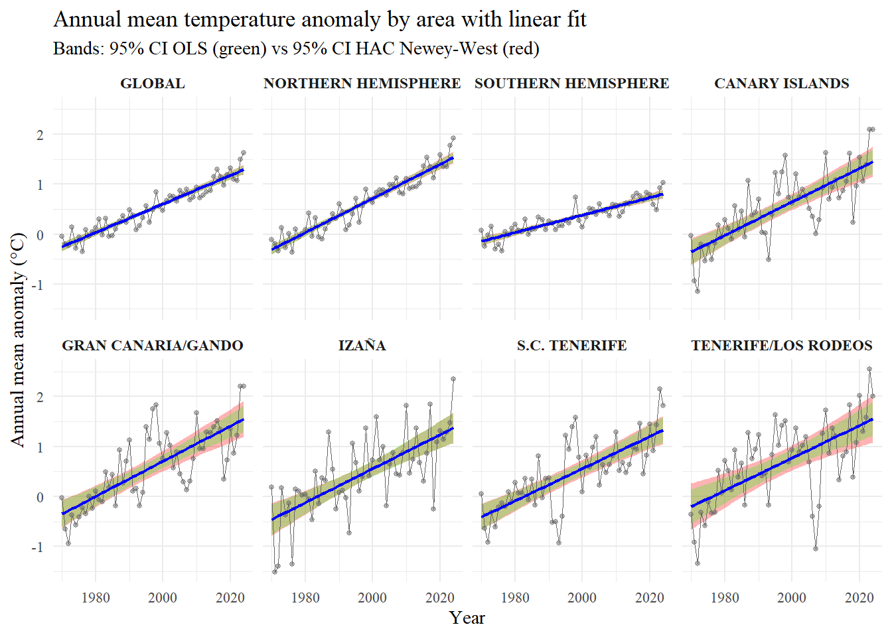

# Temperature Anomaly Analysis in the Canary Islands (1970–2024)

<p align="center">
  
  
  
</p>

<br>

<p align="center">
  
</p>

<p align="center">
  <i>
  Annual mean temperature anomalies (1970–2024) across global, hemispheric and Canary Islands series.<br>
  Linear trends are shown together with 95% confidence intervals (OLS and HAC Newey-West).
  </i>
</p>

---

## Key findings

> 🌍 **Consistent warming across all regions (1970–2024)**  
> 🇮🇨 Canary Islands exhibit warming rates **comparable to the Northern Hemisphere**  
> 📈 Linear trends provide a **robust and stable description**  
> ⚖️ Non-linear models improve fit by **< 2% → linearity holds**  
> 🔍 Evidence of **global acceleration vs possible regional deceleration**

---

## Contents

- 📊 `temperature_anomaly_analysis.html` → **full report (recommended reading)**  
- 🧠 `temperature_anomaly_analysis.Rmd` → source code  
- 📝 `OBS_018.docx` → conference paper (short version)  
- 📁 `temperature_anomaly_2025.rds` → dataset  
- ⚙️ `utilities.R` → helper functions  
- 📈 `dashboard_anomalies_en.html` → interactive dashboard  
- 🧩 `*_cache/`, `*_files/` → RMarkdown dependencies  

---

## Overview

This repository presents a **fully reproducible statistical analysis** of temperature anomaly trends in the Canary Islands between **1970 and 2024**, analysed within a **global and hemispheric context**.

The study combines:

- **HadCRUT5** → global and hemispheric temperature series  
- **AEMET** → high-resolution observational data from the Canary Islands  

The HTML report included in this repository represents the **full extended version** of the study, while a shorter version was prepared for conference submission.

> 📄 **Full report available:**  
> The complete analysis (methodology, diagnostics and results) is included as an HTML document in this repository.

---

## Scientific contribution

This work addresses the following question:

> **Are recent temperature trends in the Canary Islands consistent with historical warming and global behaviour?**

Main contributions:

- 🌍 Integrated comparison of **global, hemispheric and regional trends**
- 📊 Full validation of linear models using **rigorous statistical diagnostics**
- 🔍 Assessment of **recent trend changes** using alternative methodologies
- ⚖️ Quantification of **non-linearity impact (<2% RMSE improvement)**

---

## Study design

The analysis includes **eight spatial series**:

| Scale        | Areas |
|-------------|------|
| Global      | Global · Northern Hemisphere · Southern Hemisphere |
| Regional    | Canary Islands (average) |
| Stations    | Izaña · Tenerife/Los Rodeos · Santa Cruz de Tenerife · Gran Canaria/Gando |

All series are analysed consistently across multiple temporal resolutions.

---

## Methodology

### Core model
- Ordinary Least Squares (OLS)

### Diagnostic framework
- Normality → Anderson-Darling  
- Homoscedasticity → Breusch-Pagan  
- Autocorrelation → Ljung-Box  
- Robust inference → HAC (Newey-West)  
- Trend validation → Mann-Kendall + Sen slope  

### Non-linear analysis
- Yeo-Johnson transformation  
- Segmented regression (changepoint detection)

### Temporal resolutions
- Monthly series  
- Annual averages  
- Month-specific models  

---

## Key results

- All analysed regions show **statistically significant warming**
- Canary Islands warming is **comparable to the Northern Hemisphere**
- Linear models provide a **robust and stable representation**
- Non-linear alternatives improve RMSE by **< 2%**
- Global series suggest **recent acceleration**
- Canary Islands show **possible recent deceleration**
- Results are consistent with **high-emission climate scenarios**

---

## Why this matters

Understanding whether regional warming follows global patterns is essential for interpreting climate change at local scales.

This study shows that:

- the Canary Islands are **fully embedded in the global warming signal**
- regional deviations may exist, but remain **statistically weak**
- relatively simple statistical models can provide **robust and interpretable insights** comparable to more complex approaches

---

## Reproducibility

Install dependencies:

```r
install.packages(c(
  "tidyverse",
  "ggplot2",
  "fpp3",
  "lmtest",
  "sandwich",
  "nortest",
  "trend",
  "patchwork",
  "kableExtra"
))
```

Render the full report:

```r
rmarkdown::render("temperature_anomaly_analysis.Rmd")
```

---

### Data sources

- HadCRUT5 → global temperature datasets
- AEMET → observational station data

Temperature anomalies are computed relative to the 1961–1990 baseline.

---

### Extended vs conference version

- 📄 HTML report → full methodology, diagnostics, robustness analysis
- 📝 Conference paper (OBS_018.docx) → condensed version of results

The extended version should be considered the primary reference.

---

### How to cite

If you use this work, please cite:

Alonso León, M., & Álvarez, L. (2026).
**Temperature anomaly evolution in the Canary Islands in a global context (1970–2024).**
XIV Congreso AEC.

Extended reproducible version (code and full analysis):
https://github.com/MariaAlonsoLeon/TemperatureAnomaly

---

### Author

**María Alonso León**

Data Scientist

- 📧 maria.alonleon6@gmail.com
- 💼 LinkedIn: your_linkedin_here
- 🎓 Universidad de Las Palmas de Gran Canaria

Research interests

- Time series analysis
- Climate data modelling
- Statistical inference

---

### License

- Code → MIT License
- Documentation & figures → CC BY 4.0

Third-party data (AEMET, HadCRUT5, etc.) remain subject to their respective licenses.
